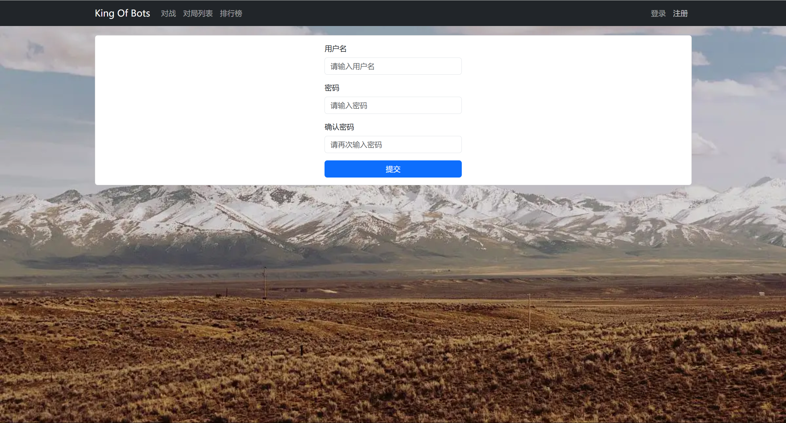
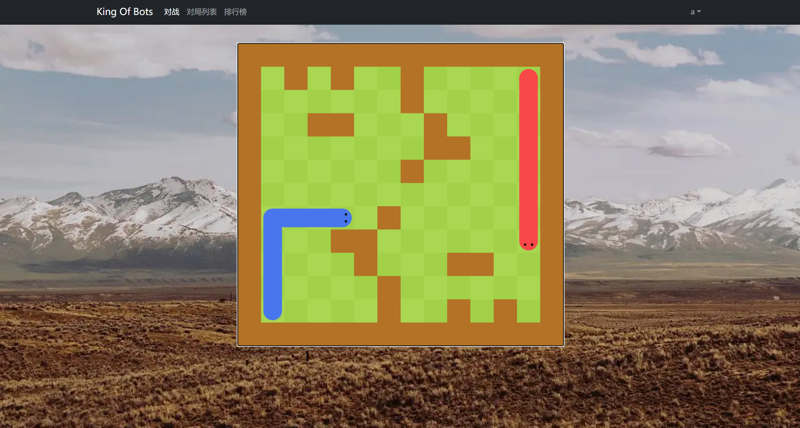
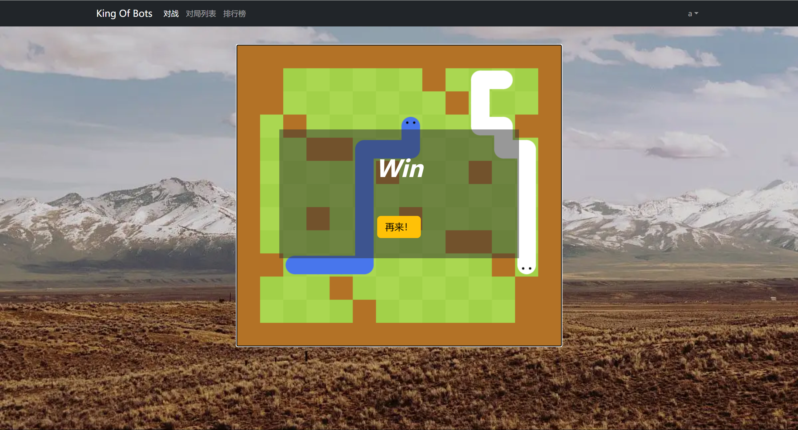
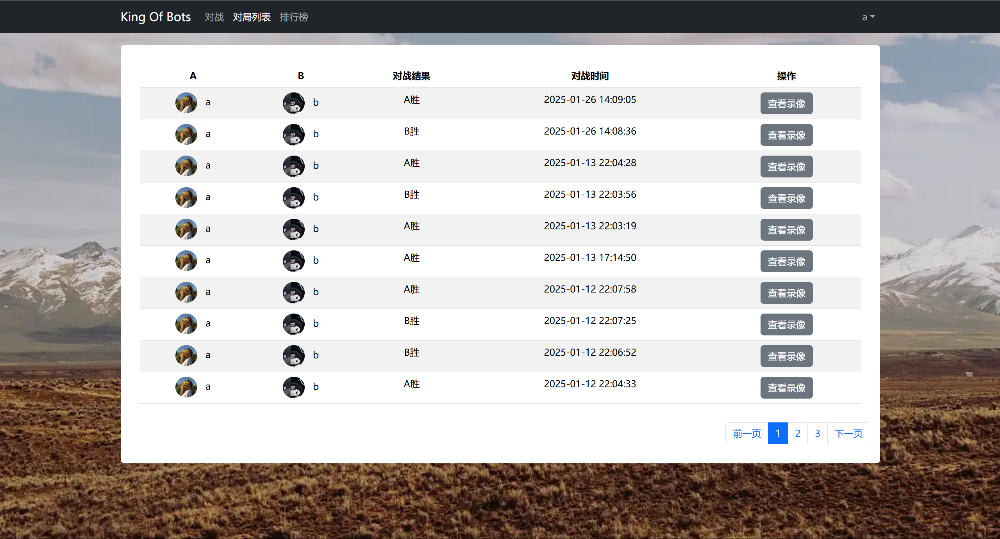
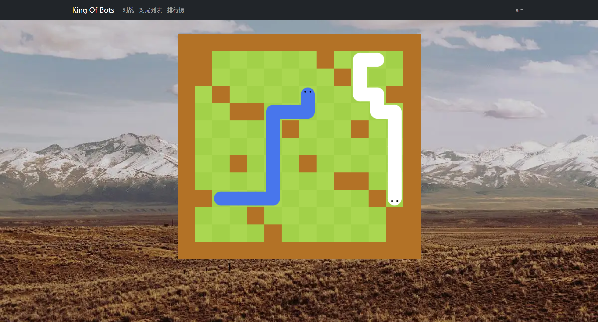
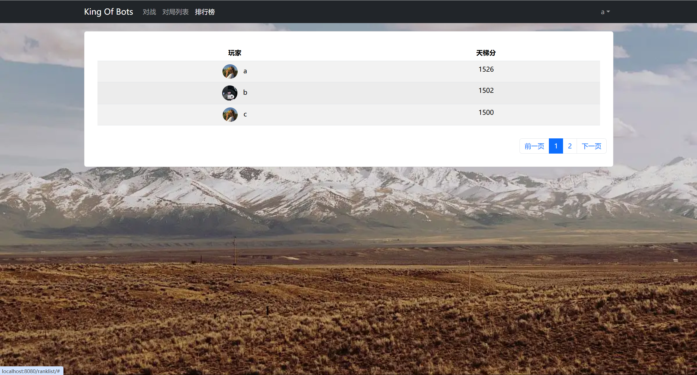
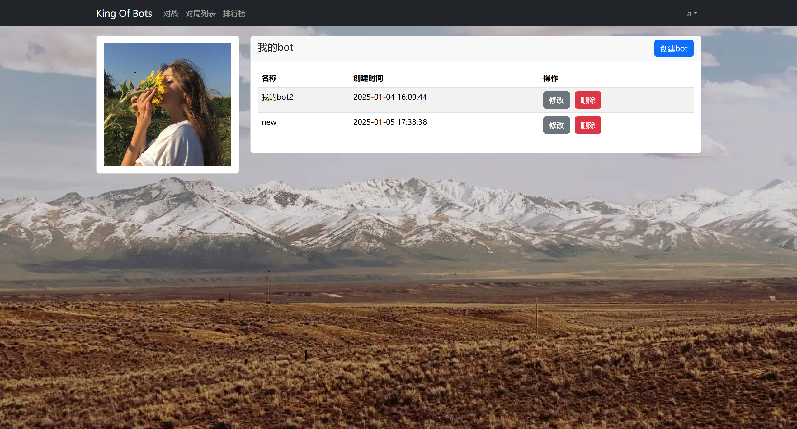
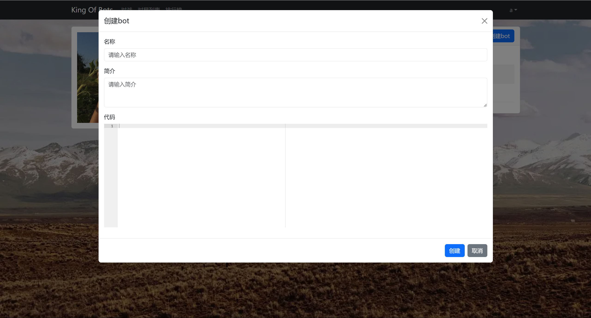
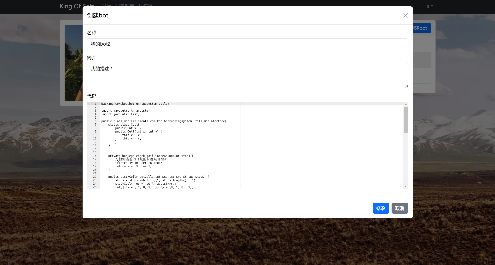

# King of Bots

### 描述：

一个双人对战的贪吃蛇平台，每名玩家可设置自己的AI bot，可以派自己的bot出战，也可以自己出战，每回合双方可向上下左右走一格，碰到墙或者对方判输。支持用户登录注册，提供游戏匹配，排行榜，对局回放功能。

### 登录注册页面：

### 匹配与游戏界面：

### 对局记录与回放页面：

### 排行榜页面：

### 个人中心页面：

### 创建与修改bot页面：

